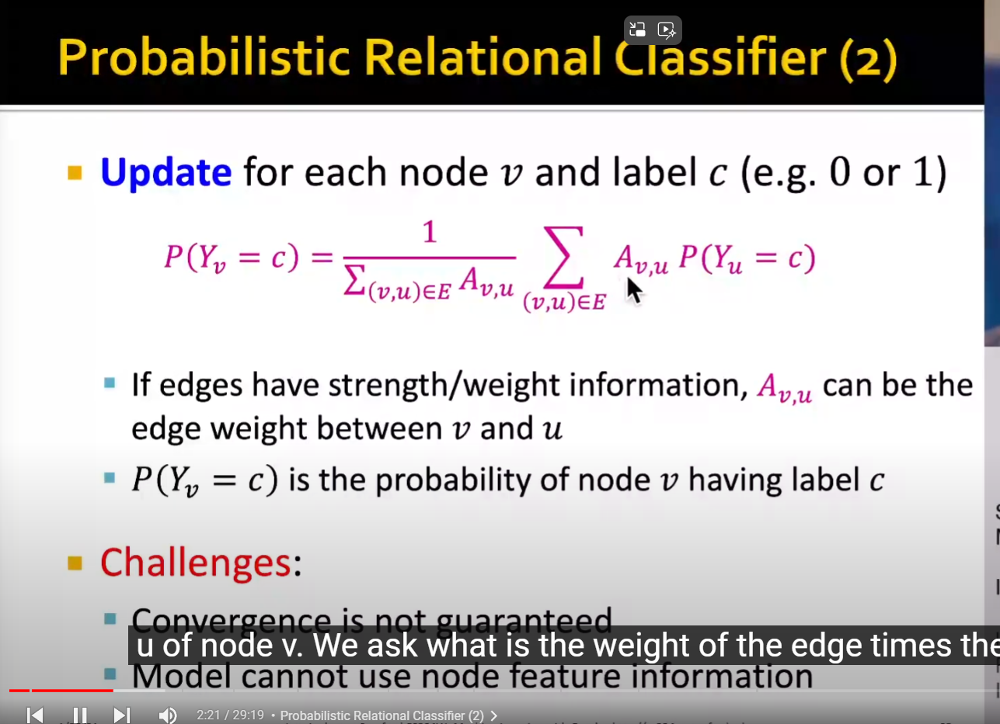
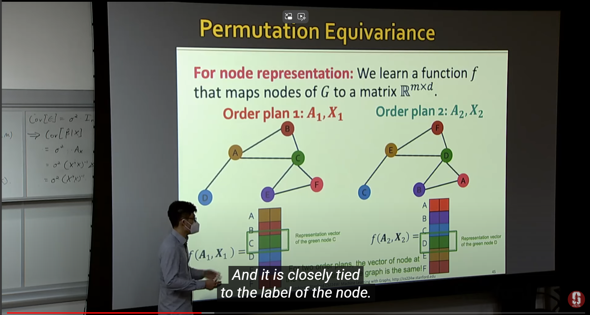
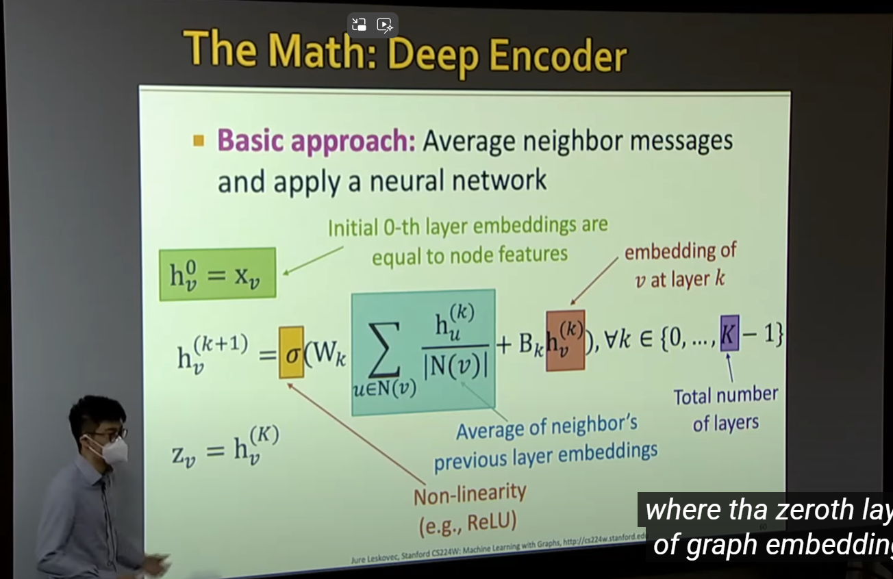
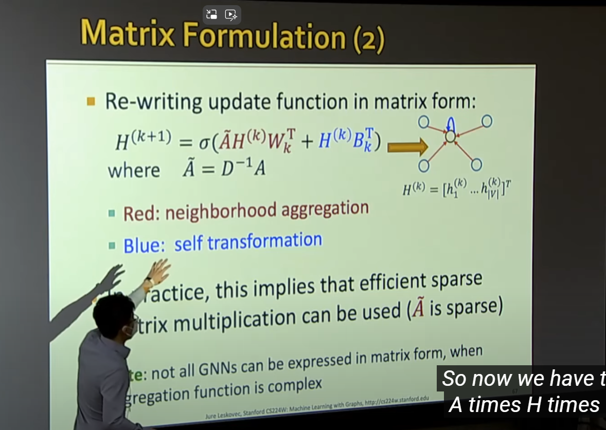
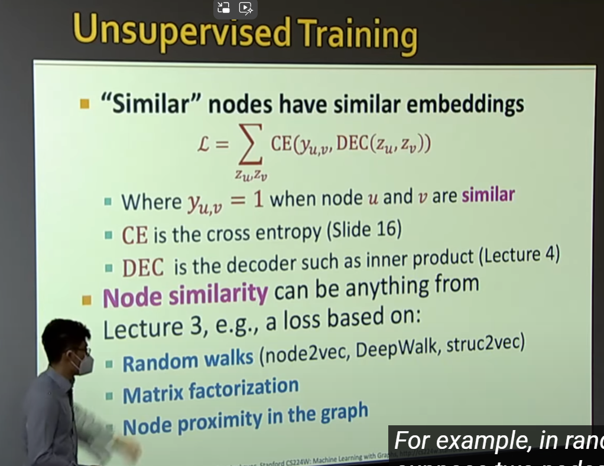
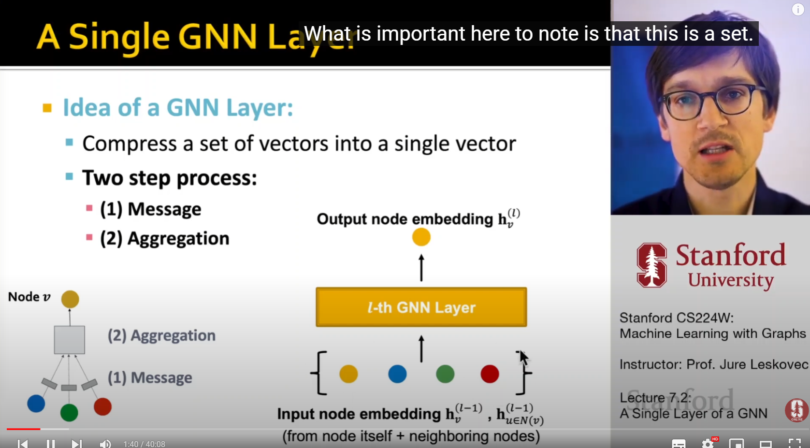
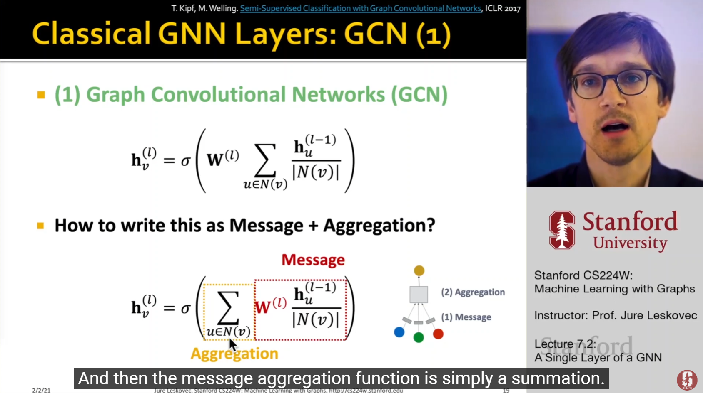
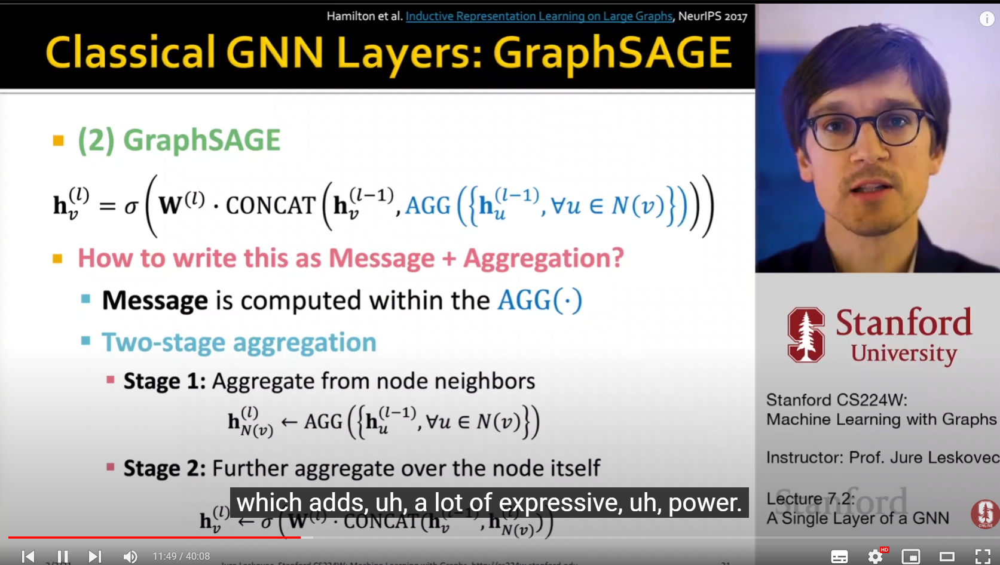
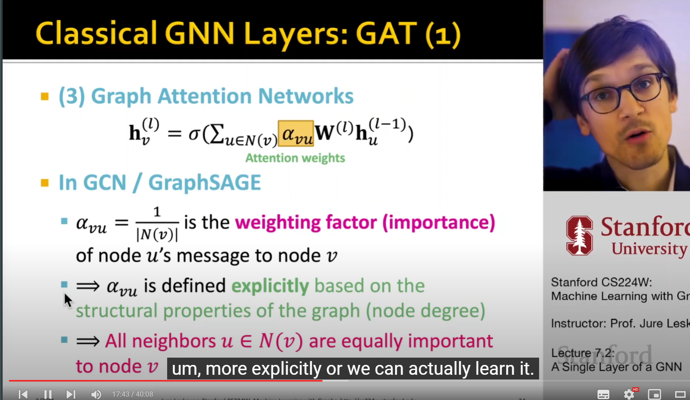
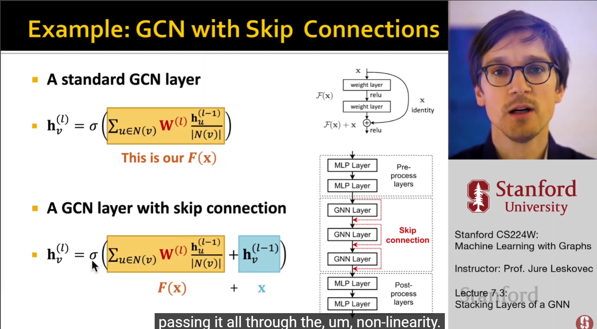

# CS224W
* The video order and the website order are inconsistent, so here the note order is also arbitrary. Some lectures will not be included.
# PageRank
## PageRank

* importance $ Im = r_i/d_i $, $ r_i $ is the importance of page i, $d_i$ is the out-link.
* Stocastic adjacency matrix: if $j \rightarrow i, M_{ij} = \frac{1}{d_j}$
* Rank vector r: $r_i$ is the importance of page i, $\sum_i r_i=1$
* Then: $ \bm{r = M } \cdot \bm{r} $ 
* Random web surfer: $def: \bm{p(t)}$ is the probablity distribution of being visited of pages in time t
* If we ask about the probability status in time t+1, we will find that: $\bm{p(t+1)}=M \cdot p(t) = p(t)$ (The probability distribution converges)
* Thus, r is a stationary distribution of random walk.
* A reminder: the eigenvector of $\bm{A}$ is written as: $\lambda \cdot \bm{r} = \bm{M \cdot r}$
* $\bm{r}$ is the principle eigenvector of $\bm{M}$ with eigenvalue 1
* Value iteration/Power iteration of $\bm{r}$
* Random teleport to solve the 1. Spider trap problem 2. Dead end problem: $G=\beta M+(1-\beta)[\frac{1}{N}]_{N\times N}$, $\bm{r}=\bm{G\cdot r}$
## Personalized Pagerank
* Yet to watch
## Matrix Factorization and Node Embeddings
* If we say that two nodes are similar that they are connected by an edge, then $Z^TZ=A$
* In real world, the embedding dimension d is much smaller than number of nodes n.
* Exact factorization $A=Z^TZ$ is generally not possible.
* But we can learn it by $min_z||A-Z^TZ||$
* If we use other similarity definition methods, you can just simply change A(the target).
* 3 limitations

# Message Passing and Node Classification
* Main question: given a network with labels on some nodes, how do we assign labels to all other nodes in the network?
* Example task: Let $A$ be a adjacency matrix, and let $Y={0,1}^n$ be a vector of labels, predict which unlabeled nodes are likely class 1/0.
1. Local Classifier: Used for initial label assignment.
2. Relational Classifier: Capture correlations
3. Collective Inference: Propogate the correlation
## Relational classification
* Class probability $Y_v$ of node v is a weighted average of class probabilities of its neighbors
* For labeled nodes v, initialize with truth value.
* 
* The denominator is "the degree of a node" if no weight on edges, the numerator is "the summation of all probabilities" of its neighbors. 
* Relatively easy
## Iterative classification
* Yet to watch
## Belief propogation
* Yet to watch

# Intro to GNN 
* V is the vertex set.
* $\bm{A}$ is the adjacency matrix.
* $\bm{X} \in \mathbb{R}^{|V|\times d}$ is a matrix of node features.
* Excursion: if you want to add information on to the edges of the graph, you may try manipulating the adjacency matrix, so it does not always cantain 0 and 1.
* The property of a graph: Permutation Invariance(Graph does not have a canonical order of the nodes), thus the output of the same network on the same encoding function should be the same.
* Math: Permutation invariant $\bm{P}$(ofcourse also a matrix) is defined as $f(A, X) = f(PAP^T, PX)$
* The encoding can either be a vector or a matrix
* The encoding of the node should always only be associated to the label of the node.
* 
* Permuatation equivariant: $P f(A, X) = f(PAP^T, PX)$: if we permute the input, the output also permutes accordingly.
* $f(A, X)=AX$ is the simple example of permutation equivariant.
## GCN
* Aggregate Neighbors
* Oversquashing/Oversmoothing: too much layers so that nodes are indistingushable.
* The formula: 
* In matrix representation:  so the parameters is just $W$ and $B$ as two matricies
* for detailed definition and examples: https://jonathan-hui.medium.com/graph-convolutional-networks-gcn-pooling-839184205692
* Note not all aggregation methods can be written in matrix form.
* Unsupervised learning: use the graph structure itself as supervision. Similar nodes have similar embeddings.
* 
* The method is scalable since the parameters(i.e. $B$ and $W$) are shared in a layer.
## A General GNN Framework
* GNN Layer = Message + Aggregation
* Layer connectivity: How do we connect layers
* Possible graph manipulation
* Learning objective
## A Single layer of GNN
* Idea of a GNN layer: Compress a set of vectors into a single vector
* 
1. Message computation: $m_u^{(l)}=MSG^{(l)}(h_u^{(l-1)})$, which means that each node will create a kind of message of itself.
2. Aggregation: Each node will aggregate the messages from its neighbors, examples may be sum, max, min. $h_v^{(l)}=AGG^{(l)}(m_u^{(l)}, m_v^{(l)})$, where v stands for the node we care about, and u stands for the node's neighbors. 
* GCN: 
* GraphSAGE:  You can see that, there is still some arbitrary-ness in the function, you decide the AGG function.
* $l_2$ Normalization: In physics language: $\frac{\bm{h_v^{(l)}}}{|h_v^{(l)}|}$ (divide by length)
* GAT: 
Add a explicit weight to the edges. This is called attention weight.
* How is attention coefficient obtained? We first calculate a bridge variable called $e_{vu}=a(\bm{W}^{(l)}h_u^{(l-1)}, \bm{W}^{(l)}h_v^{(l-1)})$, where a is an arbitrary mechanism. 
* Then we use Softmax on $e_{vu}$: $\alpha _{vu}=\frac{exp(e_{vu})}{\sum _k exp(e_{vk})}$, which is basically doing a exponential and normalize the weights.
* We can have various attention mechanism a: such as creating a single layer neural network. In the network we can still make use of the same $W$ weight matrix.
* But sometimes the system is hard to converge, so we introduce Multi-head attention: we use multiple (e.g.: 3) different mechanism a, and after aggregating for the first time, we aggregate them again. This is intuitively more robust (we have more parameters to average on) in a sense.
* A exhaustive GNN Layer at modern times may be: $Linear \rightarrow BatchNorm \rightarrow Dropout \rightarrow Activation \rightarrow Attention \rightarrow Aggregation$......
* Batch Normalization: given a matrix of node embeddings, recenter and rescale the input to $N(0, 1)$, note this function is implemented on vectors, not scalars.
* Dropout: with some probability p, randomly turn off some neurons.
* Activation: ReLU, Sigmoid, PReLU......
* GNN designs can utilize GraphGym
## Stacking GNN Layers
* Sequential (normal way of doing it)
* The over-smoothing problem: we talked about it earlier.
* Receptive field: the set of nodes that determine the embedding of a node of interest. 
* If two nodes have highly-overlapped receptive field, then their embeddings are highly similar.
* How to make a shallow GNN more expressive?
1. Increase the expressive power within each GNN layer(such as replacing $B$ and $W$ with a 3-layer MLP)
2. Add MLP preprocessing and postprocessing layers, which does not care about neighbor feature.
3. Add skip connections in GNNs. Simply just add them up.

## GNN Augmentation and Training
### Graph augmentation
* Idea: Raw input graph $\neq$ computational graph
* The reason why we want to do this: the input graph might be to sparse/dense/large/lack features
1. Graph feature augmentation: the input graph lacks features. 
We can: Assign a constant value to each node. 
Or: Assign unique vector to node (e.g. node5 have [0, 0, 0, 0, 1, 0]), this is computationally and storage-ly expensive.
Why do we need the feature augmentation? this is because if nodes are indistinguishable, the node cannot differentiate rings, since they will have the same computational graph. 
Other augmented features: Node degree, clustering coefficient, pagerank, centrality...
2. Augment sparse graphs: Connect edegs that does not exist. 
We can: Connect 2-hop heighbors: that is, use $A+A^2$ as adjacency matrix. 
Note that $A^2$ decodes a bipartite graph, for example, transforming the author-book relation to author-author and book-book relation. 
Or: Add a virtual node and connect it to every node in the graph.
3. Augment big/dense graphs: Randomly sample a node's neighborhood for message passing. But we may loose some expressive power of the node.
The roll of random neighbors can be refreshed everylayer to improve robustness. 
Or: we can choose to aggregate the "top 100 important" neighbors. 
