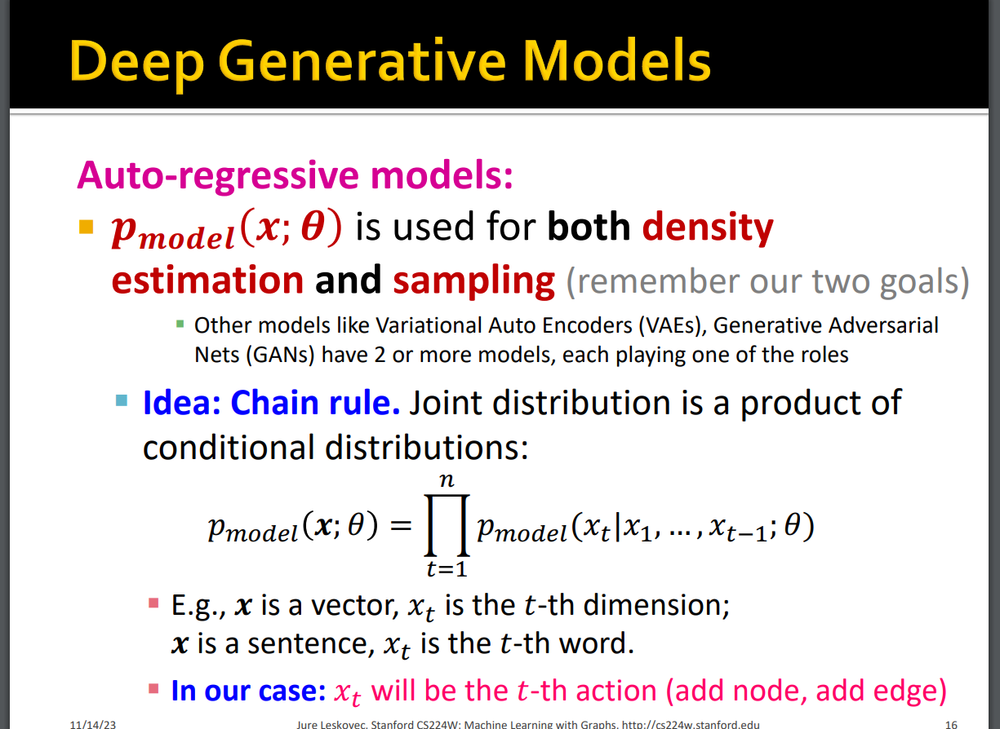
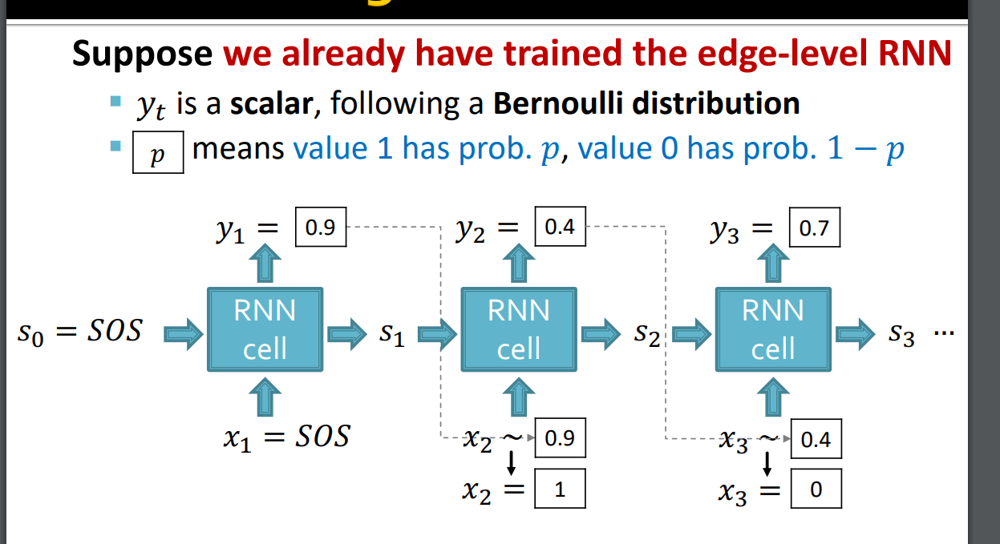

# CS224W
* The video order and the website order are inconsistent, so here the note order is also arbitrary. Some lectures will not be included.
# PageRank
## PageRank

* importance $ Im = r_i/d_i $, $ r_i $ is the importance of page i, $d_i$ is the out-link.
* Stocastic adjacency matrix: if $j \rightarrow i, M_{ij} = \frac{1}{d_j}$
* Rank vector r: $r_i$ is the importance of page i, $\sum_i r_i=1$
* Then: $ \bm{r = M } \cdot \bm{r} $ 
* Random web surfer: $def: \bm{p(t)}$ is the probablity distribution of being visited of pages in time t
* If we ask about the probability status in time t+1, we will find that: $\bm{p(t+1)}=M \cdot p(t) = p(t)$ (The probability distribution converges)
* Thus, r is a stationary distribution of random walk.
* A reminder: the eigenvector of $\bm{A}$ is written as: $\lambda \cdot \bm{r} = \bm{M \cdot r}$
* $\bm{r}$ is the principle eigenvector of $\bm{M}$ with eigenvalue 1
* Value iteration/Power iteration of $\bm{r}$
* Random teleport to solve the 1. Spider trap problem 2. Dead end problem: $G=\beta M+(1-\beta)[\frac{1}{N}]_{N\times N}$, $\bm{r}=\bm{G\cdot r}$
## Personalized Pagerank
* Yet to watch
## Matrix Factorization and Node Embeddings
* If we say that two nodes are similar that they are connected by an edge, then $Z^TZ=A$
* In real world, the embedding dimension d is much smaller than number of nodes n.
* Exact factorization $A=Z^TZ$ is generally not possible.
* But we can learn it by $min_z||A-Z^TZ||$
* If we use other similarity definition methods, you can just simply change A(the target).
* 3 limitations

# Message Passing and Node Classification
* Main question: given a network with labels on some nodes, how do we assign labels to all other nodes in the network?
* Example task: Let $A$ be a adjacency matrix, and let $Y={0,1}^n$ be a vector of labels, predict which unlabeled nodes are likely class 1/0.
1. Local Classifier: Used for initial label assignment.
2. Relational Classifier: Capture correlations
3. Collective Inference: Propogate the correlation
## Relational classification
* Class probability $Y_v$ of node v is a weighted average of class probabilities of its neighbors
* For labeled nodes v, initialize with truth value.
* 
* The denominator is "the degree of a node" if no weight on edges, the numerator is "the summation of all probabilities" of its neighbors. 
* Relatively easy
## Iterative classification
* Yet to watch
## Belief propogation
* Yet to watch

# Intro to GNN 
* V is the vertex set.
* $\bm{A}$ is the adjacency matrix.
* $\bm{X} \in \mathbb{R}^{|V|\times d}$ is a matrix of node features.
* Excursion: if you want to add information on to the edges of the graph, you may try manipulating the adjacency matrix, so it does not always cantain 0 and 1.
* The property of a graph: Permutation Invariance(Graph does not have a canonical order of the nodes), thus the output of the same network on the same encoding function should be the same.
* Math: Permutation invariant $\bm{P}$(ofcourse also a matrix) is defined as $f(A, X) = f(PAP^T, PX)$
* The encoding can either be a vector or a matrix
* The encoding of the node should always only be associated to the label of the node.
* 
* Permuatation equivariant: $P f(A, X) = f(PAP^T, PX)$: if we permute the input, the output also permutes accordingly.
* $f(A, X)=AX$ is the simple example of permutation equivariant.
## GCN
* Aggregate Neighbors
* Oversquashing/Oversmoothing: too much layers so that nodes are indistingushable.
* The formula: 
* In matrix representation:  so the parameters is just $W$ and $B$ as two matricies
* for detailed definition and examples: https://jonathan-hui.medium.com/graph-convolutional-networks-gcn-pooling-839184205692
* Note not all aggregation methods can be written in matrix form.
* Unsupervised learning: use the graph structure itself as supervision. Similar nodes have similar embeddings.
* 
* The method is scalable since the parameters(i.e. $B$ and $W$) are shared in a layer.
## A General GNN Framework
* GNN Layer = Message + Aggregation
* Layer connectivity: How do we connect layers
* Possible graph manipulation
* Learning objective
## A Single layer of GNN
* Idea of a GNN layer: Compress a set of vectors into a single vector
* 
1. Message computation: $m_u^{(l)}=MSG^{(l)}(h_u^{(l-1)})$, which means that each node will create a kind of message of itself.
2. Aggregation: Each node will aggregate the messages from its neighbors, examples may be sum, max, min. $h_v^{(l)}=AGG^{(l)}(m_u^{(l)}, m_v^{(l)})$, where v stands for the node we care about, and u stands for the node's neighbors. 
* GCN: 
* GraphSAGE:  You can see that, there is still some arbitrary-ness in the function, you decide the AGG function.
* $l_2$ Normalization: In physics language: $\frac{\bm{h_v^{(l)}}}{|h_v^{(l)}|}$ (divide by length)
* GAT: 
Add a explicit weight to the edges. This is called attention weight.
* How is attention coefficient obtained? We first calculate a bridge variable called $e_{vu}=a(\bm{W}^{(l)}h_u^{(l-1)}, \bm{W}^{(l)}h_v^{(l-1)})$, where a is an arbitrary mechanism. 
* Then we use Softmax on $e_{vu}$: $\alpha _{vu}=\frac{exp(e_{vu})}{\sum _k exp(e_{vk})}$, which is basically doing a exponential and normalize the weights.
* We can have various attention mechanism a: such as creating a single layer neural network. In the network we can still make use of the same $W$ weight matrix.
* But sometimes the system is hard to converge, so we introduce Multi-head attention: we use multiple (e.g.: 3) different mechanism a, and after aggregating for the first time, we aggregate them again. This is intuitively more robust (we have more parameters to average on) in a sense.
* A exhaustive GNN Layer at modern times may be: $Linear \rightarrow BatchNorm \rightarrow Dropout \rightarrow Activation \rightarrow Attention \rightarrow Aggregation$......
* Batch Normalization: given a matrix of node embeddings, recenter and rescale the input to $N(0, 1)$, note this function is implemented on vectors, not scalars.
* Dropout: with some probability p, randomly turn off some neurons.
* Activation: ReLU, Sigmoid, PReLU......
* GNN designs can utilize GraphGym
## Stacking GNN Layers
* Sequential (normal way of doing it)
* The over-smoothing problem: we talked about it earlier.
* Receptive field: the set of nodes that determine the embedding of a node of interest. 
* If two nodes have highly-overlapped receptive field, then their embeddings are highly similar.
* How to make a shallow GNN more expressive?
1. Increase the expressive power within each GNN layer(such as replacing $B$ and $W$ with a 3-layer MLP)
2. Add MLP preprocessing and postprocessing layers, which does not care about neighbor feature.
3. Add skip connections in GNNs. Simply just add them up.

## GNN Augmentation and Training
### Graph augmentation
* Idea: Raw input graph $\neq$ computational graph
* The reason why we want to do this: the input graph might be to sparse/dense/large/lack features
1. Graph feature augmentation: the input graph lacks features. 
We can: Assign a constant value to each node. 
Or: Assign unique vector to node (e.g. node5 have [0, 0, 0, 0, 1, 0]), this is computationally and storage-ly expensive.
Why do we need the feature augmentation? this is because if nodes are indistinguishable, the node cannot differentiate rings, since they will have the same computational graph. 
Other augmented features: Node degree, clustering coefficient, pagerank, centrality...
2. Augment sparse graphs: Connect edegs that does not exist. 
We can: Connect 2-hop heighbors: that is, use $A+A^2$ as adjacency matrix. 
Note that $A^2$ decodes a bipartite graph, for example, transforming the author-book relation to author-author and book-book relation. 
Or: Add a virtual node and connect it to every node in the graph.
3. Augment big/dense graphs: Randomly sample a node's neighborhood for message passing. But we may loose some expressive power of the node.
The roll of random neighbors can be refreshed everylayer to improve robustness. 
Or: we can choose to aggregate the "top 100 important" neighbors. 
### Graph Training
* The GNN Training Pipeline: 
* In the prediction head we can have node/edge/graph level tasks
1. For node-level prediction, we can make the prediction using the node embedding. 
$$h_v^{(l)}\in \mathbb R^d$$
$$\hat y_v=Head_{node}(h_v^{(l)})=W^{(H)}h_v^{(l)}, \hat y_v\in \mathbb R^k$$
As we can see, we directly use a dimentional reduction matrix W to do the classification work.
2. For edge-level prediction, we can define a function of taking in two nodes and output a confidence that if there is actually a link between it. 
$$\hat y_{uv}=Head_{edge}(h_u^{(l)}, h_v^{(l)})$$
An option for $Head$ might be concatenating the two embeddings together and apply some linear function to the 2d-dimentional embedding. 
Or: You may use simply a dot product of these two embeddings. 
Or: k-way prediction 
 
3. For graph-level predction, we can imagine that we should construct a function that takes in every embedding information in the graph and output some kind of classification cofidence vector. 
$$\hat y_G=Head_{graph}(\forall_{(v\ in\ G)} h_v^{(l)}\in \mathbb R^d)$$ 
Options are: global mean pooling, global max pooling, global sum pooling, hierarchical global pooling
* Supervised learning has some true labels, whilst unsupervised learning does not. Note that unsupervised learning still use the true value when calculating the loss function and back-propogating, but does not use any true value in the forward process.
* A example of unsupervised learning may be "train a GNN to predict node clustering coefficient" "hide the edge between two nodes, predict if there should be a link" "predict if two graphs are isomorphic".
* Loss function: It is important to differentiate whether the task is classification or regression.
1. Classification Loss: 
   * Cross entropy (CE): 
   * $$CE(y^{(i)}, \hat{y}^{(i)})=-\sum_{j=1}^K y_j^{(i)}log(\hat y_j^{(i)})$$ 
   * This means that we only care about how close the correct category is from the predicted value, for example the target might be [0, 0, 1, 0, 0], and what we predicted is [0.1, 0.3, 0.4, 0.1, 0.1], then we can see that the result is $-1\cdot log(0.4)$
2. Regression Loss:
   * Mean squared error (MSE):
   * $$MSE(y^{(i)}, \hat{y}^{(i)})=-\sum_{j=1}^K (y_j^{(i)}-\hat y_j^{(i)})^2$$
   * Trivial
3. Evaluation Metrics (Regression):
   * RMSE, MAE (Mean absolute error)
4. Evaluation Metrics (Classification):
   * Simply use accuracy
   * But if your classes are imbalanced, for example having 99% of the data is cat1, the model will get a high accuracy by just predicting all nodes are cat1. Thus we need a new model.
   * 
   * The concept of a ROC Curve:
   *  
   * You can imagine the perfect prediction should be on the top left, so the bigger the area under the curve is, the better the performance the classifier is.
   * But how about multiple-class classifier?
## Setting up a GNN
* Fixed split into 3 Datasets: 
1. Training set
    Used for optimizing GNN parameters, like calculating loss.
2. Validation set
    To investigate how well the model is doing when setting up the model, to make changes to the hyperparameters.
3. Test set
    To test final performance of the model on completely unseen data.
* But splitting data in a graph is a problem.
* The method of splitting data: 1. compute the embedding using the entire graph 2. we break the edges between the splits.
* 1 will cause some leakage of graph linkage information, 2 will cause some link information to be lost. 1 is called transductive setting, 2 is called inductive setting.
* In graph classification, only inductive setting is well defined. 
* Link prediction: predict missing edges
* Concretely, we need to hide some edges from the GNN to let it predict it. For link prediction, we will split the edges twice.
  1. We will assign two types of edges in the original graph (message edges, supervision edges), after this step, the supervision edges (edges to predict) will not be used by GNN
  2. Then we further split the edges into train/validation/test. Each ofcourse contains its own message and supervision edges. So that is a total number of 2*3=6 sets of edges. 
  Note the training process of transductive and inductive is different, with one randomly taking out edges from the original graph, the other taking out edges step by step.
# GNN Mastery
## Designing the Most Powerful GNN
* local neighborhood structures
* Can GNN node embeddings distinguish different node's local neighborhood structures?
* A computational graph: how the mode's information is passed through the graph.
* 
* Most expressive GNN maps different rooted subtrees into different node embeddings.
* Recall: we call f a injective function if for every x in the input, it corresponds to a different y.
* If each step of GNN's agregation is a injective function, the GNN is most expressive.
* HOW?
* Observation: Neighbor aggregation can be abstracted as a function over a multi-set. (several nodes and their corresponding feature vector)
* GCN: GCN is a mean pooling, thus cannot distinguish between multi-sets with the same color propotion.
* GraphSAGE: GraphSAGE is a max pooling, thus cannot distinguish different multi-sets with the same set of distinct colors.
* Thus, GCN and GraphSAGE are not the most expressive GNNs.
* Math: Theorem: Any injective multi-set function can be expressed as: $\Phi (\sum _{x\in S} f(x))$
* How to model $\Phi$ and $f$ in the formula?
* We use a multi-layer perceptron. It is proved that 1-hidden layer MLP can learn any function if its dimention is big enough.
* $MLP_{\Phi}(\sum_{x \in S}MLP_{f}(x))$, in practice, a dimension of 100-500 is enough.
* This is called GIN.
* Before we talk about the full model of GIN, we relate back to the WL graph kernel.
* WL graph kernel: 
* The complete GIN model: 
$$GINConv(c^{k}(v), (c^{(k)}(u))_{u \in N(v)}) = MLP_{\Phi}((1+\epsilon)\cdot c^{(k)}(v)+\sum _{u\in N(v)}c^{(k)}(u))$$
where $\epsilon$ is a learnable parameter.
* Other method to improve the expressive power of a GNN: 1. add more information on a node so the nodes are also distingushable 2. Improve the computational graph structure
## Label Propagation
* Main question: Given a network with labels on some nodes, how do we assign labels to all other nodes in the network?
* Given labels of some nodes, let's predict labels of unlabeled nodes. This is called transductive node classification. (we only want to predict labels on this specific graph)
* The intuition is: correlations exist in networks.
* Homophily: The tendency of individuals to associate and bond with similar others.
* Social influence: Social connections can influence the individual characteristics of a person.
1. Label propagation
   * See "Relational classification" above
   * applications: Document classification, tweet classification
   * Limitations: converge slow, doesn't use label features.
2. Correct & Smooth
   * We observed that <b> GNN uses labels to train the weights of a model, but given a trained model, predictions for different node are independent/uncorrelated!</b> But in label propagation, the labels are used directly.
   * Uncorrelated GNN predictions can be catastrophic in simple cases when features are only mildly predictive. (I believe this is the problem that I encountered)
   In the picture, since the nodes are asymmetric around 0 degree and have similar structures, the network would always want to give the average prediction which is wrong. 
   In this case, label propagation will preform better than GNN.
   * The steps:
      1. Train a base predictor that predict soft labels over all nodes. The base predictor can be simple, like a linear model/MLP over node features, or a full GNN.
      2. Given a trianed base predictor, we apply it to obtain soft labels for all the nodes.
      3. Correct: The key idea is that we expect errors in the base prediction to be positively correlated along edges in the graph. If the error of a guy is huge, we will expect that the error will similarly appear in its neighbors.
      
      $$\widetilde{A} \equiv D^{-1/2}AD^{-1/2}$$
      SMOOTH OPERATOR ~~~: After the correction step, we get the label $Z^{(0)}$. Then we diffuse $Z^{(0)}$ through the entire graph.
      * Question: Correct and Smooth for the non-classification problem?
3. Masked label prediction
   * treat the labels directly as features.
   * But you can't use the labels to predict the labels itself. 
## Heterogeneous Graphs
* Different types of nodes: Authors and papers
* Different types of edges: Likes and cites
* Relation types: (node_start, edge, node_end) -> 8 relation types in the example above.
* Definition: $G = (V, R, T, E)$, $T$ is the node type, $E$ is the edge type, $R$ is the relation type.
* Approach 1: treat types of nodes and edges as features, such as a "one hot encoding".
* But this approach cannot solve the problem of having different feature dimensions.
### RGCN
* Use different neural weights for different relation types.
* Introduce a set of neural networks for each relation type. (or weight matrix?)
* 
* However, each relation would have L matrices: $W_r^{(1)}, W_r^{(2)}...W_r^{(L)}$, which in all have a dimension of $l^2\times L\times R$, so as the numbers of relations grow, the number of parameters grow rapidly.
1. Block diagonal marices: make the weights sparse.
2. Basis learning: Share weights across different relations: $W_r = \sum ^B_{b=1}a_{rb}\cdot V_b$, where $V_b$ is shared across all relations. Here one $a_{rb}$ is juat a scalar.
* Link prediction for heterogeneous graph: skip
## Heterogeneous Graph Transformer
* RGAT: does not quite understand...
## Knowledge Graph Embeddings
* Edges in KG are represented as triples (h, r, t), head has relation with tail.
* Key idea: model entities and relations in the embedding/vector space $\mathbb R^d$ (shallow embedding)
* Given a true triple (h, r, t), the goal is that the true embedding of (h, r) should be close to the embedding of t.
### TransE
* $h + r = t$ if the given fact is true, else opposite.
* scoring function $f_r(h, t) = -||h+r-t||$
* Example: Obama + Nationality = American
* Four relation patterns: 
  1. Symmertric: roommate
  2. Inverse: (Advisor, Advisee)
  3. Composition (Transitive): My mother's husband is my father
  4. 1-to-N: many tails (students) are students of a head (teacher).
### TransR
### DistMult
### ComplEx
## Reasoning in KG
* Predictive queries in KG: one-hop queries, path queries, conjunctive queries.
* one-hop query: is t an answer to query (h, r)?
* path query: v -> r1 -> r2 -> ... -> rn -> V?
* Problem of KG: KGs are notoriously incomplete.
* Predictive queries: predict what entities are the answer to the query.
## Answering predictive queries in KGs
* Key idea: embed queries to query point $q$
* $q=h+r$, query embedding $q$ is close to the answer embedding $t$.
* TransE can handle composition relations, whilst others can't.
* Conjunctive queries: "and" "what are the drugs that cause short of breath and treat diseases associated with protein ESR2?": 
## Query2box
* How to define the intersection operator in the embedding space?
* Box bmbedding: embed queries with hyper-rectangles.
* This is because intersection of boxes is well defined.
* Projection Operator $\mathcal{P}$: $Box \times Relation \rightarrow Box$, it move and expand a specific box.
* Intersection Operator $\mathcal{J}$
* 
* 
* Define entity-to-box distance: 
* How do we handle union operators? (OR)
* It is observed that we cannot union too much quries in a low dimensional space, since there will be some points in the middle of all points that is not required in the union. You cannot exclude it, thus making the embedding fail.
* This conclues that the dimension of the embedding space has to be bigger than the number of entities.
* And we push the union process to the very last step.
*  The entity is at least close to one box q.
* The process of embedding any AND-OR query q: 
## Training a Query2box
* Parameters to learn: Entity embeddings, relation embeddings, intersection operators.
* Training process:  The negative sample has the type of the answer, e.g. American, German. 
* An example
## Fast Nerual Subgraph Matching & Counting
* Subgraphs are the building blocks of networks.
* Node induced subgraph: Take a subset of the node and all the edges are induced by the nodes.
* Edge induced subgraph: Take a subset of the edges and all the corresponding nodes.
* Graph Isomorphism: 
* Subgraph Isomorphism: $G_2$ is subgraph-isomorphic to $G_1$ if some subgraph of $G_2$ is isomorphic to $G_1$. This problem is NP-hard. 
* Network Motifs: "recurring, significant patterns of interconnections." 
* Pattern: small (node-induced) subgraph
* Recurring: Found how many times, i.e. frequency
* Significant: more frequent than expected
* Node-anchored subgraph: also finding subgraph, but we only care about different positions of a given node, not all the node in the subgraph.
* Now, let's define motif significance, the idea is that subgraph that occur in a real network much more often than a random network have functional significance. 
* But how do we generate random graphs? ER random graphs/Configuration model. 
* Z-score: 
* A very interesting use in practice: 
## Neural Subgraph Matching
* How to decide whether a query graph is a subgraph in the target graph? 
* Given a input graph, decompose it into neighborhoods, and then do the query. 
* 
* But how we decompose the original graph $G_T$ into heighborhoods? 
* For each node in $G_T$, obtain a k-hop heighborhood around the anchor. This can be performed using BFS. Depth $k$ is a hyper-parameter. Then we embed the anchor node. 
* Order embedding space: 
* Lower-left has the same structure of subgraph and hypergraph. Subgraph isomorphism relationship can be nicely encoded in order embedding space. 
* So now the goal is to learn a GNN to preserve the embedding structure. How do we design the loss function then? 
* Order constraint: specifies the ideal order embedding property that refects subgraph relationships. 
* 
  Here, $G_q$ is actually a subgraph of $G_t$. As we can see in the picture, if in the embedding space we correctly embeded them, $E(G_q, G_t)=0$, else we will receive a error number. 
* To learn such embeddings, we construct training examples $(G_q, G_t)$ where half the time $G_q$ is a subset of $G_t$. For positive examples we use the loss function above. For negative examples we use $E' = max(0, \alpha - E(G_q, G_t))$.
* We can use BFS to construct positive examples and corrupt the example's edges to get negative examples. The BFS depth is often 3-5.
* How to predict: 
## Finding Frequent Subgraphs
* Generally, finding the most frequent size-k subgraphs requires two major challenges:
1. Enumerating all size-k connected subgraphs;
2. Counting #(occurence of each subgraph type).
* This is more like a exhaustive enumerating approach, which is almost obviously computationally hard.
* Solution: Representation learning.
1. In counting occurences of each subgraph type, the solution is to use GNN to predict the frequency of the subgraph. 
2. In enumerating all size-k connected subgraphs, the solution is to construct a size-k subgraph incrementally. 
* SPMiner: 
* 
* We just count how much points fall on the top right of the given sub-structure. 
* Start with an individual node, grow motif by iteratively choosing a neighbor in $G_T$ of a node in $S$(the motif) and add that node to $S$. 
* Choose the growing node greedyly: maximize the number of neighborhoods in the "top right" area after k step. 
* Total violation is defined as the number of neighborhoods that do not contain $Q$. Violation + Frequency = Constant. 
* SPMiner is fast and accurate in both small and large graphs. 
## Community Detection in Networks
* Problem: How does information "flow" through the social network? 
* An interesting observation: contacts finding jobs were often acquaintances rather than close friends. 
* Structually embedded edges (strong edges within a group) are heavily redundant in terms of information access: since if one of the members know a information, it is very likely that all in the group would know. We don't need that much edges to represent. 
* Triadic closure: 
* Revision Time:
* Parameter: Modularity $Q$: A measure how well a network is partitioned into communities. 
* $Q \propto \sum _{s\in S}[\# edges\ in\ group\ s-expected(random)\ \# edges\ within\ group\ s]$, the second is determined by a random graph model.
* Calculation: 
  Here $\frac{k_i k_j}{2m}$ stands for the average edges between i and j if given a random graph.
## Louvain Algorithm
* Omitted, will watch if needed
## Detecting Overlapping Communities
* Omitted, will watch if needed
## Recommender Systems
* Recommender system can be naturally modeled as a bipartite graph. 
* Recommendation task can be cast as a link prediction problem. 
* Possible application in GIS: human trajecotory prediction.
* For $u \in U, v\in V$, we need to get a real-valued score $f(u,v)$.
* 2-stage process: 1. Candidate generation 2. ranking. 
* 
* Recall@K = $|P_u \cap R_u|/|P_u|$, where $P_u$ is the positive items, $R_u$ is the recommended items. 
### Embedding for recommender systems
* Let the user u and the item v have both a D-dimensional embedding, so that the score function is $f_\theta(\cdot,\cdot)$
* Two surrogate loss functions are widely-used to enable efficient gradient-based optimization: Binary loss, Bayesian Personalized Ranking (BPR) loss. 
* 
* But this penalize the possible positive edges for they may not be ranked higher than the negative edges of another user. 
* BPR Loss:
* So now we have positive and negative edges for each user. 
* 
* Why embedding models work? The underlying idea is called collaborative filtering. It recommend items by collecting preferences of many other similar users. The key question is how to capture similarity between users and items?
* Conventionally we just use the shallow embedding for the embedding. 
* NGCF: Neural Graph Collaborative Filtering
* Key idea: Use a GNN to genrerate the embedding for each user and item. 
* 
* LightGCN motivation: The GNN parameters may not be so essential in the modeling. Shallow embedding is expressive enough. 
* 
* 
* We just use a single parameter matrix. 
* Multi-scale Diffusion: 
* 
  We consider the effect of a node of different distance to different weights.
* The reason why LightGCN works so well is that it encourages the embeddings of similar users/items to be similar through diffusion.
* PinSAGE: Unifies visual, textual, and graph information.
* Goal: Generate embeddings for nodes in a large-scale Pinterest graph containing billions of objects.
* Key idea: Borrow information from nearby nodes. 
## Deep Generative Problem for Graphs
* We want to generate realistic graphs using graph generative models.
* Example: generating roads, formation of cities
* Goal 1: Realistic graph generation: generate graphs that are similar to a given set of graphs
* Goal 2: Generate graphs that optimize given objectives/constraints.
* Idea: approximate $p_{data}(G)$ with $p_{model}(G)$ (Density estimation), then sample from $p_{model}$
* Key Principle: Maximum likelihood distribution
   $$\theta^* = argmax (\mathbb E_{x~pdata}log\ p_{model}(x|\theta))$$
* Then generate the sampling from a random seed and a deep neural network. 
* Auto-regressive models: 
### GraphRNN
* Define a graph generating sequence $S^\pi$
* Which is actually the top right part of the adjacency matrix.
* RNN: Sequentially takes input sequence to update its hidden states.
* 
* GraphRNN has a node-level RNN and a edge-level RNN. The node-level RNN generates the initial state for edge-level RNN. The edge-level RNN sequentially predict if the new node will connect to each of the previous node.
* 
* 
* 
* Loss: binary cross entropy
* Minimize: $L = -[y_1^* log(y_1)+(1-y_1^*)log(1-y_1)]$
* The training process: 
* Tractability of the problem: Too many steps for edge generation.
* BFS Node ordering: rearrange the node orders such that the node that has already been traversed won't exist in the upcoming linking steps. For example, if node 4 doesn't connect to node 1, then all nodes > 4 would not be connected to node 1. 
* How to define graph similarity: 1. Visual 2. Graph statistics
* Graph statistics similarity: 1. Earth mover distance (EMD) 2. Maximum mean discrepancy (MMD)
### GCPN
* GCPN: GNN + RL (reinforcement learning)
* Predict links based on node embeddings.
* 
### Summary
* Possible tasks: 
  1. Imitating a set of given graphs
  2. Optimizing graphs towards given goals
# Advanced Topics on GNN
## Expressive GNNs
* Even though two nodes may have the same neighborhood structure, we may want to assign different embeddings to them. 
## Position-aware GNNs
* 
* Naive solution: one-hot encoding
* Two types of tasks on graphs: structure-aware tasks, position-aware tasks
* The "Anchor": randomly pick nodes $s_i$ as the anchor nodes. Represent $v_i$ and via their relative distances w.r.t. the anchor. 
* Or you can expand the notion to anchor set, which is a set of multiple anchors.
* Goal: try to embed the nodes into the Euclidean space so that the distance in the space approximates the distance. 
* 
* 
* Further clarification on $S_{i, j}$: $i$ stands for the probability of a node being selected, $j$ stands for the times that you random sample on. (This is my personal deduction straight from the paper and the PPT, which may be inconsistent with what the professor said in class. The original word in class was: <i>The first index is the number of anchor sets of a given size, the second index is the size of the anchor set. </i>I found this very confusing. )
* You can imagine, this process should be permutational variant: if you put the vector straight onto the feature of the node, by changing the order of the sampling set, the output should then change, which is not rigorous. Thus we introduce another special NN to solve the problem. 
* 
## Identity-aware GNNs
* Failure case: different inputs but the same computational graph.
* Inductive node coloring: we can assign a color to the node we want to embed.
* ID-GNN: An ID-GNN applies different message/aggregation to nodes with different colorings. 
* 
* Very similar to RGCN, but now we only care about the source type, but not the relation type. This is faster.
## Robustness of GNN
* Direct attack, indirect attack
* GCN is robust to random noise